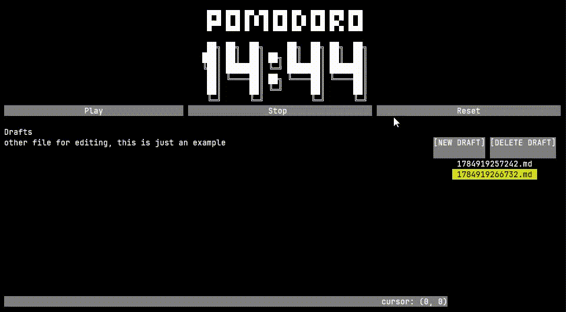
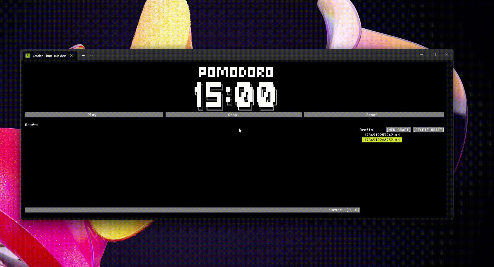

# Pomodoro CLI

A simple terminal-based Pomodoro timer with a built-in text editor for keeping notes and drafts—all in one place.



## Features

- Pomodoro timer with play, pause, and reset controls
- Short and long breaks
- Configurable timer durations and cycle interval
- Built-in text editor for notes and drafts
- Responsive interface for smaller terminal windows
- Automatic local storage for your drafts

## How It Works

The first time you run Pomodoro CLI, it creates the following directory for storing your drafts:

```text
$HOME/.config/pomodoro/
```

The interface has two main sections:

1. **Timer** — Displays the current session and provides controls to start, pause, and reset it.
2. **Drafts** — Lists your saved drafts and includes a simple text editor for creating and editing them.

Start the application by running:

```bash
pomodoro
```

## Timer Configuration

By default, the timer uses the following configuration:

| Setting | Default |
|---|---:|
| Pomodoro | 15 minutes |
| Short break | 5 minutes |
| Long break | 15 minutes |
| Long-break interval | Every 3 Pomodoros |

After the configured number of Pomodoro sessions, a long break replaces the next short break and the cycle starts again.

You can customize these values with command-line options:

```bash
pomodoro --pomodoro 10 --short-break 3 --long-break 6 --interval 7
```

Short-form options are also available:

```bash
pomodoro -p 10 -s 3 -l 6 -i 7
```

### Available Options

| Short option | Long option | Description |
|---|---|---|
| `-p` | `--pomodoro` | Pomodoro duration in minutes |
| `-s` | `--short-break` | Short-break duration in minutes |
| `-l` | `--long-break` | Long-break duration in minutes |
| `-i` | `--interval` | Number of Pomodoros before a long break |

## Compact Mode

Pomodoro CLI adapts to smaller terminal windows by switching to a compact timer-only interface.

In compact mode, press `Space` to pause or resume the timer.



## Build from Source

### Prerequisites

Install the [Bun runtime](https://bun.sh/) before building the project.

### Build

Clone the repository, install its dependencies, and compile the executable:

```bash
bun install
bun run compile
```

The compiled executable will be generated as `pomodoro.exe`.

Run it from your terminal:

```bash
./pomodoro.exe
```

You can optionally add the executable to your system's `PATH` so it can be launched from anywhere with:

```bash
pomodoro
```

## Roadmap

### Version 1

- [x] Pomodoro timer
- [x] Simple text editor for drafts
- [x] Responsive layout for smaller terminal windows

### Version 2

- [ ] Editable text editor configuration